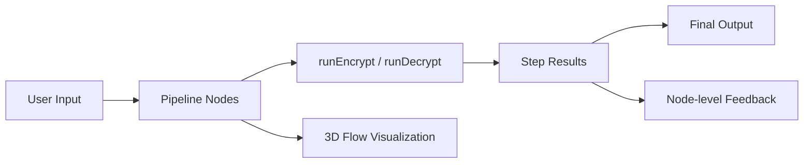

# CipherStack

A visual, node-based cascade encryption workbench built for demos and judges.

CipherStack lets users chain multiple ciphers, run encryption or decryption through the pipeline, inspect each transformation step, and visualize flow in both 2D and 3D.

## Why This Project Stands Out
- It turns abstract cryptography steps into a visual pipeline users can understand quickly.
- It supports multiple classical and practical encoding/transformation stages in one flow.
- It includes live preview, per-node error reporting, import/export, and a polished interactive hero experience.
- It is deployable as a static app with no build step.

## Live Concept
Users build a pipeline of cipher nodes, configure each node, then run data through the chain.

1. Input text enters the first node.
2. Output from each node becomes input for the next.
3. Final output is shown with run statistics.
4. Decryption mode automatically traverses nodes in reverse.

## Core Features
- Node-based pipeline builder
- Six cipher modules
- Encrypt and decrypt modes
- Per-node configuration controls
- Real-time live preview
- Per-node error handling and step tracing
- Pipeline presets (Beginner, Intermediate, Advanced)
- Pipeline import/export as JSON
- Output copy and Base64 copy actions
- Animated hero section with Spline 3D integration
- In-workspace 3D flow visualization (Three.js)
- Mobile-aware fallback behavior

## Cipher Modules Included
- Caesar Cipher
- XOR (hex output)
- Vigenere Cipher
- Rail Fence Cipher
- Base64
- Reverse

## Tech Stack
| Layer | Technology |
|---|---|
| UI runtime | React 18 (via CDN) |
| Animation | Framer Motion |
| Hero 3D | Spline (`@splinetool/react-spline`) |
| Pipeline 3D view | Three.js |
| App architecture | Vanilla ES modules, no bundler |
| State engine | Pure functions in `pipeline.js` |
| Cipher engine | Registry + algorithms in `ciphers.js` |
| Deployment | Vercel static hosting |

## Repository Structure
- `index.html` : Main single-file app shell and UI orchestration
- `ciphers.js` : Cipher registry, metadata, and encrypt/decrypt implementations
- `pipeline.js` : Immutable pipeline state management and execution helpers
- `PipelineFlow3D.jsx` : Three.js pipeline scene used in the workbench
- `vercel.json` : Static routing setup for Vercel
- `.vercelignore` : Excludes local-only/non-app artifacts from deployment
- `VERCEL_DEPLOYMENT.md` : Additional deployment and troubleshooting notes

## Architecture Overview

## How the Pipeline Works
### Encrypt Mode
- Traverses nodes from first to last.
- Applies each node's `encrypt()` with node config.
- Stores each transformation in step results.

### Decrypt Mode
- Traverses nodes from last to first.
- Applies each node's `decrypt()` with node config.
- Reconstructs original text when configs and pipeline are correct.

## Data and State Design
- Pipeline updates are immutable.
- Every node has:
  - `id`
  - `cipherKey`
  - `config`
- Execution returns structured step records:
  - `nodeId`
  - `cipherKey`
  - `input`
  - `output`

## Theming and Visual System
The app now uses centralized theme tokens in `index.html` for fast color experimentation.

- Active theme is controlled by `ACTIVE_THEME`.
- Included presets:
  - `cyber`
  - `legacy`

To switch look instantly, change:
- `const ACTIVE_THEME = "cyber";` to `"legacy"`

## Running Locally
This is a static app, so no `npm install` or build is required.

Use any static server:
1. VS Code Live Server, or
2. Python server:
   - `python -m http.server 5500`
3. Open:
   - `http://localhost:5500/`

## Deploying on Vercel
Recommended project settings:
1. Framework Preset: `Other`
2. Build Command: empty
3. Output Directory: empty
4. Install Command: empty

`vercel.json` is configured to:
- serve real files first
- fallback to `index.html` for app routes

## Judge Quick Walkthrough
1. Open landing page and inspect hero demo.
2. Enter workspace.
3. Click a preset to load a full pipeline.
4. Paste plaintext and run encryption.
5. Switch to decrypt and verify round-trip behavior.
6. Expand nodes to inspect step-by-step transformations.
7. Export pipeline JSON and re-import it.
8. Observe 3D pipeline animation while running.

## Known Scope Notes
- This is an educational/demo cipher explorer, not production-grade cryptography.
- TSX component files in `components/` are optional artifacts and not part of the current static runtime path.

## What This Demonstrates
- Clear modular architecture
- Practical state management
- Visual-first UX for complex logic
- Reliable static deployment
- Rapid theming and presentation polish
